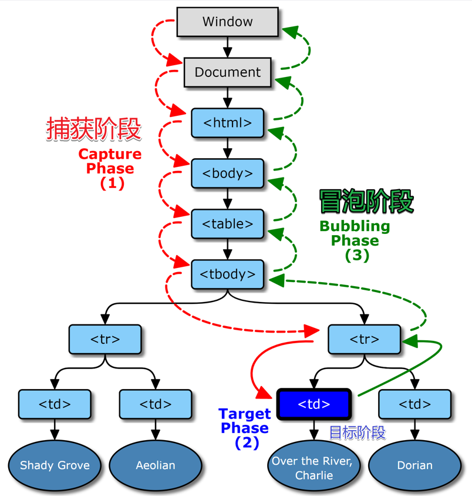

## 事件模型
事件发生后，浏览器监听到这个事件，就会执行对应的监听函数，这是事件驱动编程模式（event-driven）的主要编程方式。有三种方法为事件绑定监听函数。
### 1. HTML的on-属性
```html
<div onclick="function()">hello</div>
```
```on + click```代表监听了```click```事件，当事件发生```on-```属性的值会传入JavaScript引擎，执行相应的代码。

需要注意的是，使用这种方法监听的代码只会在冒泡阶段触发，什么是冒泡阶段将会在下文解释。
```html
<div onclick="console.log(2)">
    <button onclick="console.log(1)">按钮</button>
</div>
<!-- 先输出1后输出2 -->
```
这段代码的监听方式只在冒泡阶段触发。

### 2. 元素节点的事件属性
```javascript
div.onclick = () => {
    console.log('hello')
}
```
同样，这种方式指定的监听函数也只会在冒泡阶段触发。
### 3. EventTarget.addEventListener()
```javascript
EvenTarget.addEventListener(type, listener[, useCapture])
```
这个监听方法接受三个参数
* ```type```事件的名称。
* ```listener```监听函数，事件触发时会调用该监听函数。
* ```uesCapture```这是一个布尔值，当为```true```时，表示监听函数将在捕获阶段触发；为```false```（默认参数）时将在冒泡阶段触发。

例子
```javascript
function f() {
    console.log("hello world")
}
let button = document.getElementById('x')
button.addEventListener('click', f, false)
```

## 事件传播机制
### 冒泡与捕获


这个传播过程分为三个阶段
* 捕获阶段，事件从```window```向下走近元素
* 目标阶段，事件到达目标元素
* 冒泡阶段，事件从元素上开始冒泡

### 注意
每个处理程序都可以访问 event 对象的属性：
* ```event.target```：引发事件的层级最深的元素，也就是用户操作的元素。
* ```event.currentTarget```：处理事件的当前元素。也就是具有处理程序的元素。

任何事件处理程序都可以通过调用```event.stopPropagation()```来停止事件，但不建议这样做。

捕获阶段很少使用，通常我们会在冒泡时处理事件。

## 事件委托
在冒泡阶段事件会传播到父节点，所以可以把子节点的监听函数写在父节点上，这种由父节点的监听函数统一处理多个子节点元素的事件的方法就叫做事件委托。

事件委托是DOM事件最有用的模式之一。它能避免不必要的内存浪费，并减少代码量，但是使用事件委托的前提是，事件必须冒泡。