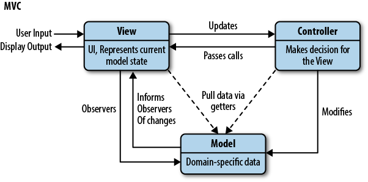

# MVC   
## MVC的三个对象
经典的MVC模式包含三类对象，将它们彼此分离可以提高代码的灵活性和复用性。

1. M —— Model，模型model用于封装数据以及数据的处理方法，会有一个或多个视图(view)监听此模型，一旦数据发送改变，模型将通知相关视图。
2. V —— View，视图view总的来说是负责处理显示在屏幕上的东西的，它描绘的是model当前的状态。模型的数据发生变化时，视图也会做出相应的行为，比如重新渲染画面。
3. C —— Controller，控制器controller定义界面对用户输入的响应方式，起到不同层面间的组织作用，用于控制应用程序的流程，它处理用户的行为和数据model上的改变。


## 前端的MVC



从上图中可以看到，view承担了一部分controller的功能，负责处理用户输入，但不用知到下一步做什么。controller依然会做出决定或者处理用户事件。在前端的view里，view已经具备独立处理用户事件的能力了，如果每个事件都要经过controller，那势必会增加复杂性。同时，view也可以委托controller处理model的更改。model数据变化后通知view进行更新，显示给用户。这个过程是一个圆，一个循环的过程。

这样看来controller的位置有些尴尬，在现在的Web系统中，controller的功能基本被系统实现了，这就造成controller和view的界限越来越模糊。随着各种前端框架的产生前端的MVC模式也发生一些变种，这种模式可以总结为MV*模式，这里就不介绍了。

# EventBus
EventBus用于多个模块间的通信。相当于一个事件管理中心，一个模块发生消息其他模块接收消息。

EventBus采用发布-订阅模式，如，A、B、C模块订阅事件X，模块D发布这个事件X，那么EventBus就会通知订阅者A、B、C，它们都会收到信息或接收到参数。


## 实现一个简单的EventBus

```javascript
class EventBus {
    // 初始化事件列表
    constructor() {
        this.eventObject = {}
    }

    // 发布事件
    publish(eventName) {
        // 获取当前事件的所有回调函数
        const callBackList = this.eventObject[eventName]
        if (!callBackList) return console.warn(eventName + 'not found!')
        // 执行每一个回调函数
        for (let callBack of callBackList) {
            callBack()
        }
    }

    // 订阅事件
    subscribe(eventName, callBack) {
        // 初始化事件
        if (!this.eventObject[eventName]) {
            this.eventObject[eventName] = []
        }
        // 储存订阅者的回调函数
        this.eventObject[eventName].push(callBack)
    }
}

// 验证
const eventBus = new EventBus()

// 订阅事件X
eventBus.subscribe('eventX', () => {
    console.log('model A')
})
eventBus.subscribe('eventX', () => {
    console.log('model B')
})
eventBus.subscribe('eventX', () => {
    console.log('model C')
})

// 发布事件
eventBus.publish('eventX')

// 输出
// >model A
// >model B
// >model C
```

# 表驱动编程
今天是周几：

```javascript
const week = new Date().getDate()
let dayOfWeek
if (week === 0) {
    dayOfWeek = '周一'
} else if (week === 1) {
    dayOfWeek = '周二'
} else if (week === 2) {
    dayOfWeek = '周三'
} else if (week === 3) {
    dayOfWeek = '周四'
} else if (week === 4) {
    dayOfWeek = '周五'
} else if (week === 5) {
    dayOfWeek = '周六'
} else if (week === 6) {
    dayOfWeek = '周天'
}
```
使用表驱动法重构上面的代码

```javascript
const week = ['周一', '周二', '周三', '周四', '周五', '周六', '周天']
const dayOfWeek = new Date().getDate()
const day = week[dayOfWeek]
```

重构后的代码比之前少了不少，也更加清晰了。表驱动编程法的最主要的优点就是数据和逻辑分离。

# 模块化
模块化就是程序的功能分成独立的“块”，“块”的内部数据是私有的，只向外部暴露一些接口给外部调用或接收参数。这非常方便维护和升级，某一功能需要增改功能时只需修改这个模块就行了，不需要去改其他地方的代码。模块是可以独立运行的，就算是一个模块出现了问题，也不会影响其他模块。